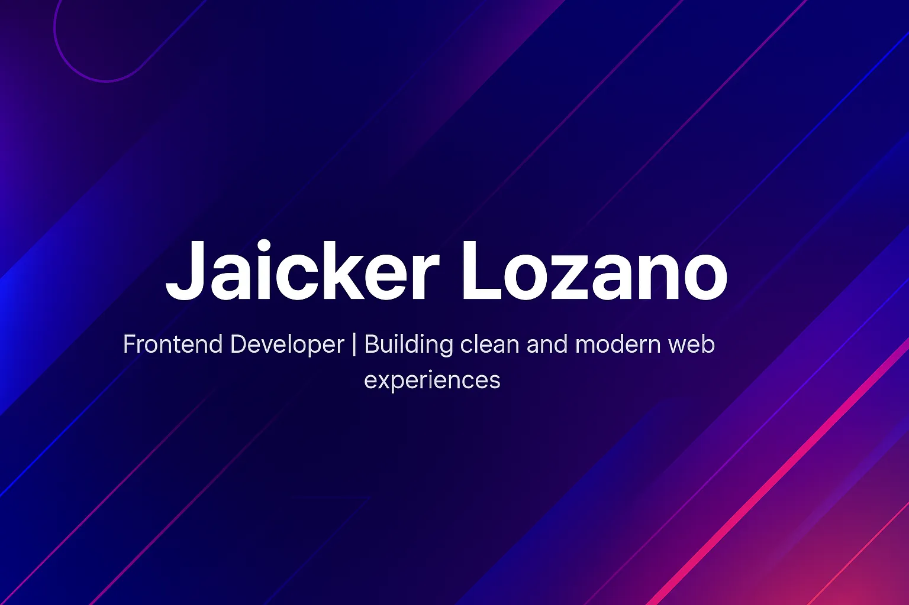

# 💻 Personal Portfolio

[](https://github.com/jaickerlozano/portfolio-jaicker/actions/workflows/deploy.yml)
[](https://react.dev/)
[](./LICENSE)

A modern, responsive, and interactive personal portfolio designed to showcase my projects, skills, and professional journey as a **Full Stack Developer**.

Built with **React 18 + TypeScript**, styled with **Tailwind CSS v4**, animated with **Motion**, and prepared for international audiences with **react-i18next**.

---

## 🚀 Overview

This project is my digital presentation card — a space where I share who I am, the technologies I work with, and the projects I’ve developed during my journey as a **Full Stack Developer**.

The goal of this portfolio is not only to display my work but also to demonstrate my understanding of **responsive design**, **component architecture**, **performance optimization**, and **modern frontend development**.

---

## 🛠️ Technologies Used

- **React 18** – UI library for building component-based interfaces.
- **TypeScript** – Static typing for safer and more maintainable code.
- **Vite** – Fast development server and optimized production builds.
- **Tailwind CSS v4** – Utility-first CSS framework for rapid styling.
- **Motion** – Smooth animations and micro-interactions.
- **react-i18next** – Internationalization (Spanish / English).
- **Formspree** – Contact form handling without a custom backend.
- **GitHub Actions** – Continuous deployment to GitHub Pages.
- **Git & GitHub Pages** – Version control and hosting.

---

## 🌟 Features

- 🌍 **Internationalization (i18n)** — Switch between Spanish and English.
- 🌙 **Dark theme** — Consistent dark-first UI.
- ✨ **Smooth animations** — Motion-powered transitions and micro-interactions.
- 📱 **Fully responsive** — Mobile, tablet, and desktop layouts.
- ⚡ **Optimized assets** — Compressed images, MP4 videos for GIFs, and lazy loading.
- ♿ **Accessibility improvements** — `aria-label`s, semantic HTML, and keyboard-friendly navigation.
- 🧩 **Modular structure** — Easy to scale and maintain.
- 📂 **Organized project files** — Clear separation of components, assets, and configuration.
- 🚀 **Live version** deployed on **GitHub Pages**.

---

## 📸 Preview

> _You can check the live version here:_  
> 👉 [Live Demo](https://jaickerlozano.github.io/portfolio-jaicker/)

---

## 📁 Project Structure

```
portfolio-personal/
├── .github/
│   └── workflows/        # GitHub Actions deployment pipeline
├── public/               # Static public assets
├── src/
│   ├── app/
│   │   ├── components/   # React components (Navbar, Hero, Projects, etc.)
│   │   └── App.tsx       # Root application component
│   ├── assets/
│   │   └── img/          # Images, icons, and optimized media
│   ├── i18n/             # Translation files (es, en)
│   └── main.tsx          # Application entry point
├── index.html
├── package.json
├── tsconfig.json
├── vite.config.ts
├── tailwind.config.js
└── README.md
```

---

## 🧪 Running Locally

Make sure you have **Node.js 18+** installed.

```bash
# Clone the repository
git clone https://github.com/jaickerlozano/portfolio-jaicker.git
cd portfolio-jaicker

# Install dependencies
npm install

# Start the development server
npm run dev
```

Open [http://localhost:5173](http://localhost:5173) to view it in the browser.

### Available scripts

| Script | Description |
|--------|-------------|
| `npm run dev` | Start the Vite development server |
| `npm run build` | Build the project for production |
| `npm run test` | Run the Vitest test suite |
| `npm run test:coverage` | Run tests with coverage report |
| `npm run lint` | Run ESLint and report errors |
| `npm run lint:fix` | Fix ESLint issues automatically |
| `npm run format` | Format code with Prettier |
| `npm run format:check` | Check code formatting with Prettier |

---

## 🧪 Testing

The project uses **Vitest** + **Testing Library** + **jsdom** for unit and integration tests of React components.

```bash
npm run test          # Run tests
npm run test:coverage # Run tests with coverage report
```

Current test suite covers the main components: `Hero`, `Navbar`, `Contact`, and `BentoProjects`.

## Calidad de Código

El proyecto usa ESLint y Prettier para mantener consistencia:

```bash
npm run lint          # Verificar errores
npm run lint:fix      # Corregir automáticamente
npm run format        # Formatear código
npm run format:check  # Verificar formato
```

## 🚀 Deploy

The project is automatically deployed to **GitHub Pages** using **GitHub Actions** every time changes are pushed to the `main` branch.

The workflow is defined in `.github/workflows/deploy.yml`.

---

## 🧠 Lessons Learned

While building this project, I strengthened my understanding of:

- Component-based architecture with React and TypeScript.
- Responsive web design principles using Tailwind CSS.
- Animation patterns with Motion (Framer Motion).
- Internationalization workflows with react-i18next.
- Performance optimization: image compression, lazy loading, and modern media formats.
- Project organization and workflow optimization using Vite.
- UI/UX thinking for better user experience and accessibility.

---

## 💬 About Me

I’m **Jaicker Lozano**, an Industrial Process Engineer and passionate **Full Stack Developer** currently completing a **Full Stack Development Master** at **Conquer Blocks**.  
I enjoy creating clean, interactive, and scalable web interfaces — always seeking to improve my skills and explore new technologies.

---

## 🤝 Connect with Me

- 💼 [LinkedIn](https://www.linkedin.com/in/jaicker-rafael-lozano-flores-970197264)
- 🐙 [GitHub](https://github.com/jaickerlozano)
- ✉️ Email: jlozano.devcode@gmail.com

---

## 🏁 Project Status

✅ **Completed** — continuously improving and adding new sections as my professional journey evolves.

---

## 📄 License

This project is licensed under the [MIT License](./LICENSE).
