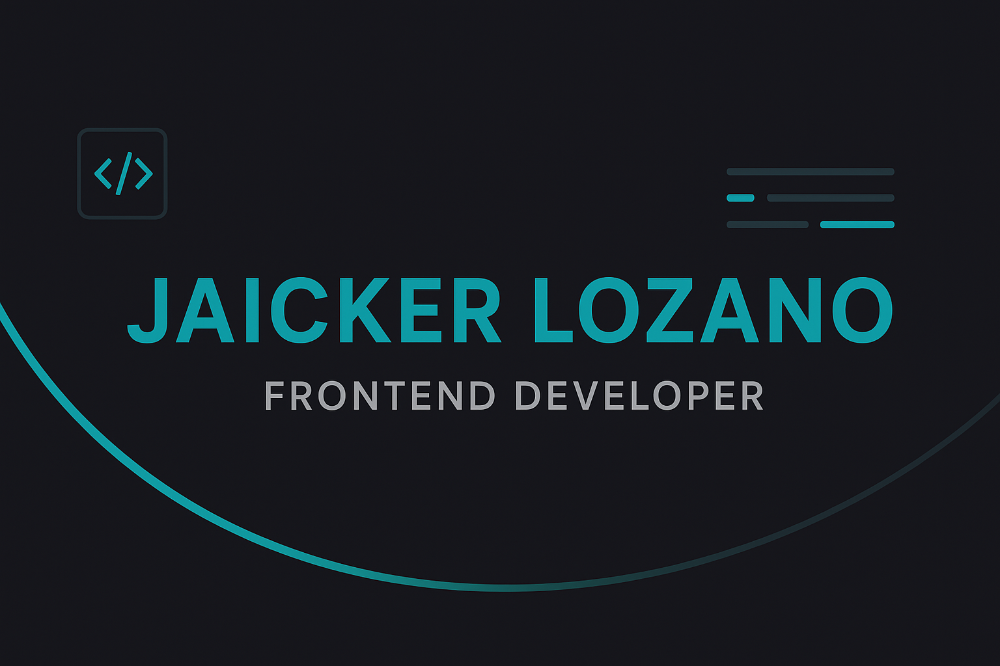

# 💻 Personal Portfolio

A modern and responsive personal portfolio designed to showcase my projects, skills, and professional journey as a **Frontend Developer**.  
Built with clean, semantic code and an emphasis on performance, accessibility, and design aesthetics.

---

## 🚀 Overview

This project serves as my digital presentation card — a space where I share who I am, the technologies I work with, and the projects I’ve developed during my journey as a **Full Stack Development Master student** at **Conquer Blocks**.

The goal of this portfolio is not only to display my work but also to demonstrate my understanding of **responsive design**, **component structuring**, and **modern frontend development** using vanilla technologies.

---

## 🛠️ Technologies Used

- **HTML5** – Semantic structure and accessibility.
- **CSS3** – Custom styling with Flexbox, Grid, and responsive layouts.
- **JavaScript (Vanilla)** – Dynamic interactions and animations.
- **Vite** – Fast and efficient development environment.
- **Git & GitHub Pages** – Version control and deployment.

---

## 🌟 Features

- ✅ Fully responsive design for mobile, tablet, and desktop devices.
- 🎨 Clean and modern UI with an emphasis on readability and usability.
- ⚡ Fast build and optimized assets thanks to **Vite**.
- 🧩 Modular structure for easy scalability.
- 📂 Organized project files for maintainability.
- 🌍 Live version deployed on **GitHub Pages**.

---

## 📸 Preview

> _You can check the live version here:_  
👉 [Live Demo](https://jaickerlozano.github.io/portfolio-jaicker/)

---

## 📁 Project Structure

📦 portfolio-personal
├── 📁 assets
├── 📁 css
├── 📁 js
├── index.html
├── vite.config.js
└── README.md

---

## 🧠 Lessons Learned

While building this project, I strengthened my understanding of:
- DOM manipulation and JavaScript event handling.
- Responsive web design principles.
- Project organization and workflow optimization using Vite.
- UI/UX thinking for better user experience.

---

## 💬 About Me

I’m **Jaicker Lozano**, an Industrial Process Engineer and passionate **Frontend Developer** currently completing a **Full Stack Development Master** at **Conquer Blocks**.  
I enjoy creating clean, interactive, and scalable web interfaces — always seeking to improve my skills and explore new technologies.

---

## 🤝 Connect with Me

- 💼 [LinkedIn](https://www.linkedin.com/in/jaicker-rafael-lozano-flores-970197264)
- 🐙 [GitHub](https://github.com/jaickerlozano)
- ✉️ Email: jlozano.dev@gmail.com

---

### 🏁 Project Status
✅ **Completed** — continuously improving and adding new sections as my professional journey evolves.
